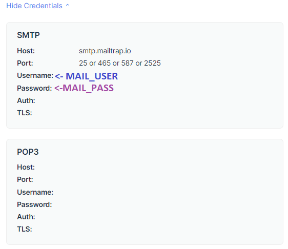
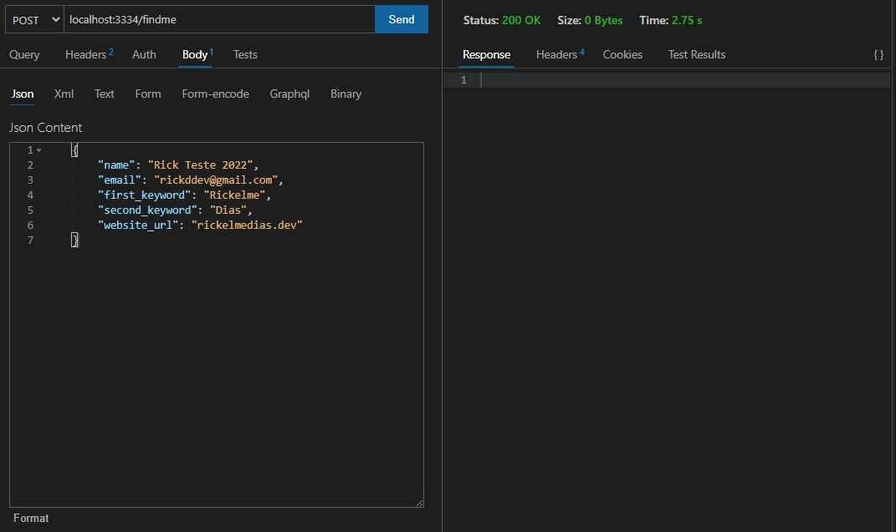
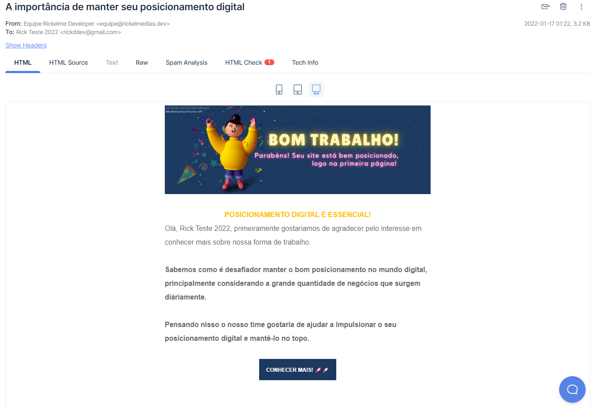
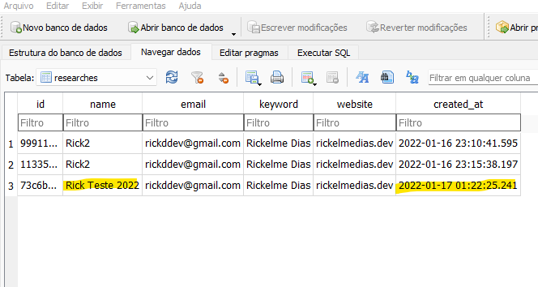

<h1 align="center">🤔 WHY WE HELP YOUR POSITION 🚀</h1>

</br>

<div align="center"></div>

<h3 align="center"> ENGLISH </h3>

> This API was created for a challenge by me (Rickelme), the API searches for the customer's website on google and returns an email to the same informed if he has a good position in the search engine.

<h3 align="center"> PORTUGUÊS </h4>

> Essa API foi criada para um desafio por mim (Rickelme), a API busca pelo site do cliente no google e retorna um e-mail para o mesmo informado se ele tem uma boa posição no buscador.

</br>
<div align="center">

<h3> Techs: </h3>


</br>
<h3> Design: </h3>


</div>

</br>
<hr/>
</br>

## 🤔 ABOUT THE IDEA 🤔

🤔 [QUAL A IDEIA DO PROJETO?](#ideia-do-projeto)


</br>

## 📖 DOCUMENTATION 📖

📖 [DOCUMENTACAO EM PORTUGUES](#DOCUMENTACAO-EM-PORTUGUES)


</br>

## 🚀 RESULTS 🚀

🚀 [RESULTADOS DO PROJETO](#resultados-do-projeto)


</br>
<hr/>
</br>

## IDEIA DO PROJETO

### Trazer interatividade com o cliente
O projeto tem a ideia de trazer mais interatividade do cliente com a HubLocal, empresa que propôs os desafio, seguindo com o tema proposto:

>" Explique por que as empresas devem ter a acesso e serem clientes da HubLocal "

### Como trazer interatividade com o cliente?
Para trazer essa interatividade HubLocal e Cliente, a API **WHY WE HELP YOUR POSITION**, faz uma análise de acordo com os dados enviados pelo cliente sobre a posição dele hoje na web. Essa API busca pelo site do cliente através de duas palavras chave digitadas.

### Qual a importância dessa interatividade?
É nesse momento que entra o diferencial da API e sua interatividade com o cliente. O cliente visualizando toda inteligência por trás do sistema de identificar o posicionamento digital de seu negócio, logo percebe a importância que estar bem posicionado traz para o negócio.

### Como fazemos a interatividade?
Para o cliente visualizar essa importância, é enviado em poucos segundos, após a consulta do serviço, um e-mail personalizado de acordo com a posição atual do cliente no mapa digital (através de buscador, como o Google).

### Porque esse serviço torna a experiência do cliente interessante?
A API recebe apenas 5 campos, o que torna a experiência do usuário (cliente) muito simples e dinâmica, além de receber um e-mail personalizado e bem formatado. Os campos que o cliente deve digitar são campos bastante diretos e ao mesmo tempo flexiveis, isso faz com quel o cliente completar as etapas e se aproximaar mais da hub, pois ele também fica interessado em saber seu posicionamento digital.

### Como esse e-mail fortace os laços com o cliente?
Nesse e-mail vai uma breve explicação sobre o porque o cliente precisa ter uma localização digital bem controlada e definida, consequentemente o porque deve fazer parte da HubLocal, em baixo tem um botão para levar diretamente a uma página de interesse da HubLocal, como um atendimento direto ou sua página princial.

</br><hr/></br>

## DOCUMENTACAO EM PORTUGUES

</br>

## Configurações iniciais para rodar o serviço
Esse projeto de API é um projeto node, onde foi utilizado o yarn, então é fundalmente fazer a instação do yarn.

### Configurando Yarn
Instale o yarn:

```sh
npm install --global yarn
```

Após instalar o yarn, faça a instalação de todos as dependencias do projeto, usando o comando:

```sh
yarn install
```

### Configurando MailTrap
Esse projeto utiliza o `mailtrap` para fazer os testes e envio de e-mail, então é fundamental ter uma conta no `https://mailtrap.io/` para esse serviço funcionar de forma adequada.

Após criar sua conta no **Mailtrap**, crie um arquivo ambiente chamado: `.env`,
esse arquivo receberá as credenciais de login do serviço.

### Configurando .env
```env
MAIL_USER=myUser123
MAIL_PASS=myPass123
```

Onde obter as credenciais? Clique na seta abaixo:

<details>

</details>
</br>

### Configurando porta do serviço
Se você estiver utilizando a porta **3334** do seu sistema, aconselho mudar a porta dessa API no arquivo `server.ts`.

</br><hr/></br>

## Banco de dados

Para que o projeto funcione em mais ambientes e sempre precisar ficar instalando diversos outros sistemas, utilizei o **SQLite**, pois já funciona bem para o desenvolvimento e demonstração.

Esse banco de dados não requer uma porta e nenhum software previamente instalado, porém precisamos criar o arquivo de banco de dados `db.sqlite`, como foi nomeado nesse projeto, para criar o arquivo já deixei pronto um script no node, basta executar:

```sh
yarn migrations
```

Se tudo der certo você terá um arquivo `db.sqlite` na pasta `/data`.

</br><hr/></br>

## Executando os testes

Foi aplicado no projeto conceitos SOLID/Clean Code que venho estudando, também apliquei TDD, que são os testes de funcionalidades, caso tenha interesse você pode executar os testes e saberá se está tudo funcionando como deveria.

Esse teste, testará inclusive sua autenticação do serviço **mailtrap**, enviando uma mensagem de teste. Para executar os testes automatizados, basta digitar em seu terminal:

```sh
yarn test
```

</br><hr/></br>

## Executando o serviço por completo

Se conseguimos passar por todas essas etapas sem problemas a API já está pronta para funcionar, inclusive essas funcionalidades abaixo deverão funcionar normalmente:

1. Envio de e-mail personalizado
> Esse e-mail estará indicando se seu site se encontra bem posicionado no buscador google (E-mail chegará no mailtrap);

2. Salvar dados no bando de dados
> Os dados enviados para fazer essa busca no google e o e-mail serão adicionados ao seu banco de dados `db.sqlite`;

Para testar se essas funcionalidades estão funcionando, vamo iniciar o serviço com o seguinte comando:

```sh
yarn start
```

</br><hr/></br>

## Enviando a requisição na API

Esse serviço possui um unico end-point, que será responsável por receber a requisição de busca: `http://localhost:3334/findme`

<table>
<tr>
<td>ENDPOINT</td> <td>http://localhost:3334/findme</td>
</tr>
<tr>
<td>METODO</td> <td>POST</td>
</tr>
<tr>
<td>BODY</td> <td>
    {
        "name": "Rick",
        "email": "email@email.com",
        "first_keyword": "Comprar",
        "second_keyword": "Carro",
        "website_url": "meusite.com"
    }
</td>
</tr>
<table>

```json
    {
        "name": "Rick",
        "email": "email@email.com",
        "first_keyword": "Comprar",
        "second_keyword": "Carro",
        "website_url": "meusite.com"
    }
```

</br><hr/></br>

## Como funciona a API

Ao enviar a requisição, esse serviço irá pegar as keywords, fazer uma busca na primeira página do google pelo seu website, se ele encontrar na primeira página significa que você possuí um bom posicionamento e é possivel ajudar a mantê-lo!

Caso não tenha encontrado na primeira página, você deverá estar entre as próximas, isso não é tão bom para o posicionamento digital, então podemos ajudar a melhorar.

</br><hr/></br>

## Resultados do projeto

Abaixo irei mostrar os resultados do projeto, por exemplo: Imagens do e-mail enviado (as **2** personalizações, mas é possível fazer **n** e-mails personalizados), Print do banco de dados armazenando as informações da requisição e o terminal do TDD.

</br>

Primeiro iniciei o serviço `yarn start` e agora vem os resultados:

</br>

### Requisição para o end-point do serviço

Essa requisição eu fiz com suas chaves bem especificas para encontrar meu portfolio na primeira página de pesquisa.
<details>
    
</details>

A requisição foi um sucesso, logo o email chegou.

</br>

### E-mail que chegou para meu posicionamento em relação essas chaves.

<details>
    
</details>

Esse foi o e-mail enviado pelo serviço e recebido pelo cliente.
Como o e-mail foi enviado, os nossos dados de consulta devem estar no banco de dados SQLite armazenado.

</br>

### Resultado no banco de dados SQLite.
<details>
    
</details>

</br>

Como foi possivel observar funcionou direitinho, agora é a sua hora de testar a outra mensagem! 🙂👋🏻

Estou a disposição para ajudar com o que for necessário, qualquer dúvida só buscar meu contato através do meu perfil do Github.

</br><hr/></br>

## Developer / Desenvolvedor

> Developer who created this project. 💖

<div align="center">
<p align="center">
<br>
<a href="https://github.com/RickelmeDias">Rickelme Dias</a>
</p>
<div>